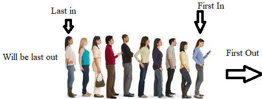

# Queue 

A Queue is a data structure that follows the process of "First in, First Out". This means that the first item that enters in the data structure is also the first item that leaves it. A real-world example is a line to get movie tickets. The sooner you get in line, the sooner you get your ticket. 

A Queue can be created in python by creating a list, and then using the append function to add items to the Queue, and using the pop function to remove items from the Queue.

(Problem Solving Using Queues)[Final Project/Queueproblems.md]

There is a very similar data struction called a stack. The struture of a stack is "Last In, First Out". This means items are taken out in the order they are put in. 